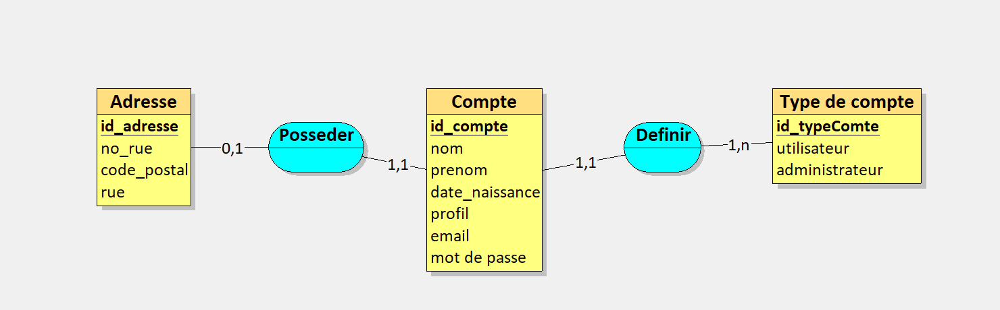
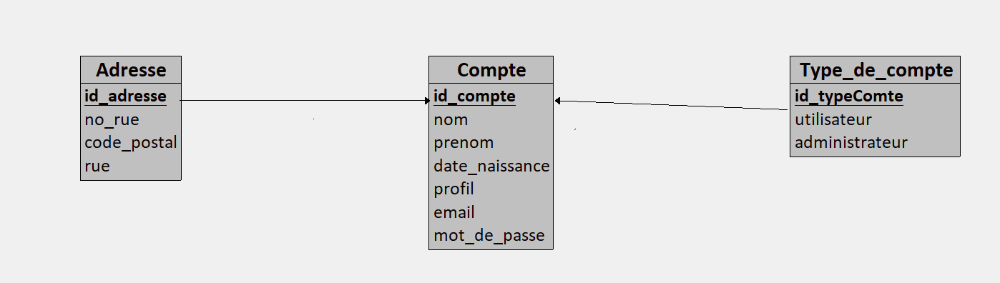
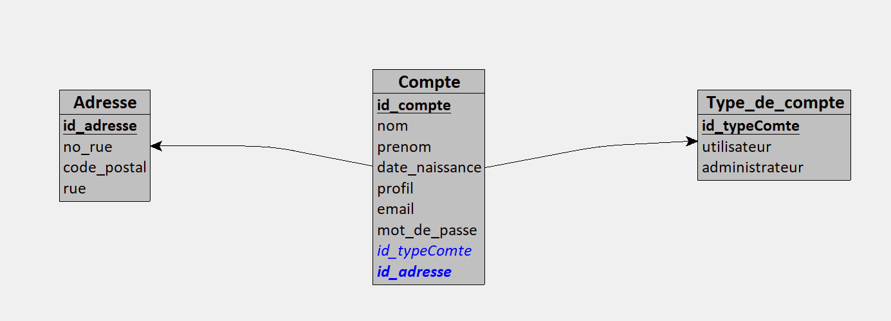
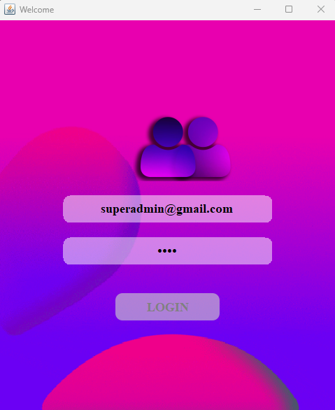
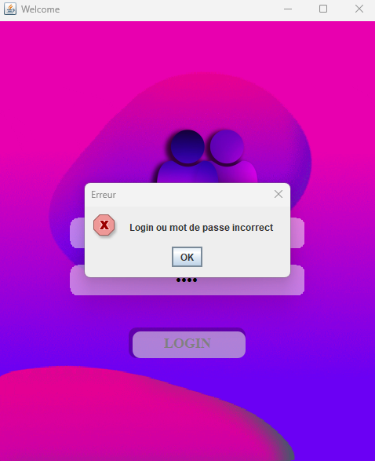
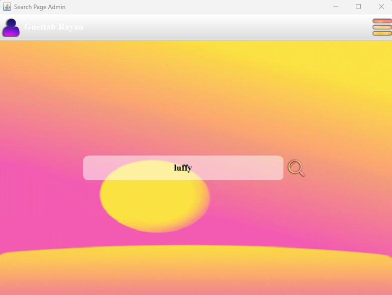
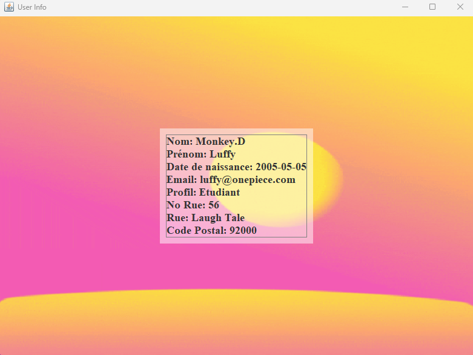
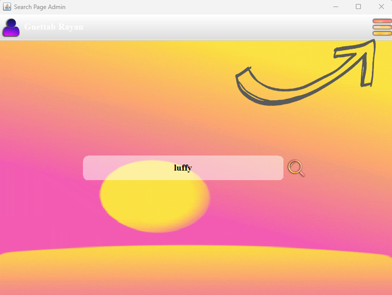
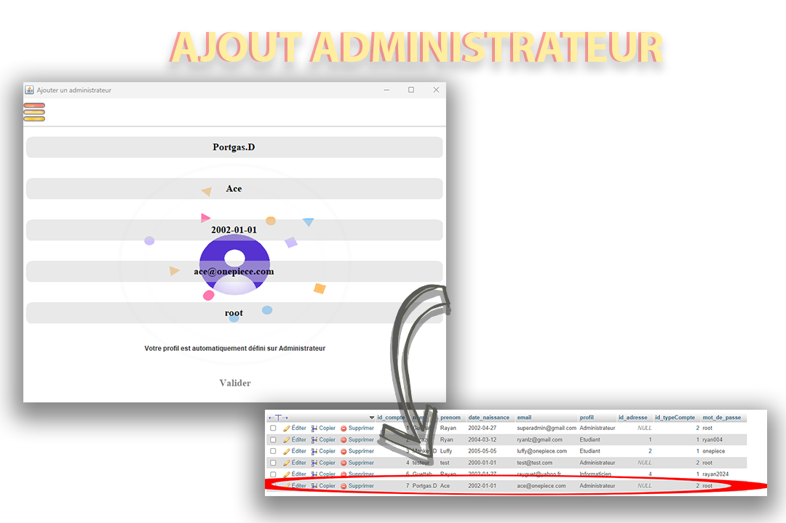
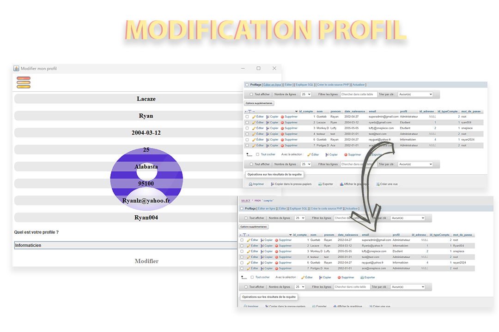

# Présentation du Annuaire-Project

## Sommaire
- [I. Objectif](#ii-bot-discord)
  - [a. Objectif du projet](#a-commandes-simples)

- [II. Conception et SQL](#i-conception-et-sql)
  - [a. MCD](#a-mcd)
  - [b. MLD](#b-mld)
  - [c. MPD](#c-mpd)
  - [d. Structure de la base de données]

- [III. Réalisation](#i-conception-et-sql)
  - [a. Interface de connexion](#a-mcd)
  - [b. Interface de recherche](#b-mld)
  - [c. Ajout d'un Adminstrateur et d'un utilisateur](#c-mpd)
  - [d. Modification de son profil](#c-mpd)

## I. Note de cadrage

### a. Objectif du projet

Le but de notre projet est de développer un logiciel complet en Java disposant de trois couches :
une IHM Swing, une couche de Services réalisant les traitements et règles de gestion et une base de
données pour la persistance des données. Le logiciel effectue la gestion d’un Annuaire simplifié 
en s’inspirant par exemple de pages blanches, sauf qu’ici il est implémenté en mode client lourd avec Swing et non pas web.

## II. Conception et SQL

Afin de bien organiser la conseption de notre base de données nous avons réaliser un MCD, un MLD et un MPD.

### a. MCD
La conception du Modèle Conceptuel de Données (MCD) pour l'annuaire de l'école comprend les entités principales et leurs relations.

### b. MLD
Le Modèle Logique de Données (MLD) traduit le MCD en un schéma logique adapté à un système de gestion de base de données relationnelle.

### c. MPD
Le Modèle Physique de Données (MPD) détaille la structure de stockage des données sur le support physique.

## III. Réalisation

### a. Interface de connexion
L'interface de connexion permet à l'utilisateur ainsi qu'à l'administrateur de se connecter via leur e-mail et leur mot de passe. 
Grâce à la connexion directe à la base de données lors de la connexion, l'interface reconnaît le type d'utilisateur connecté, soit administrateur, soit utilisateur, 
et permet également de savoir si les identifiants de connexion sont corrects ou incorrects.

      

### b. Interface de recherche
Cette interface permet à l'administrateur ou l'utilisateur de rechercher une personne, via son nom, son prénom, son e-mail ainsi que son profil.

L'interface inclut aussi un bouton menu permettant de dérouler le choix entre l'ajout d'un administrateur, l'ajout d'un utilisateur ou la déconnexion ; cela concerne les choix pour l'administrateur.
L'utilisateur, lui, pourra seulement modifier son profil ou se déconnecter.

### c. Ajout d'un Adminstrateur et un d'un utilisateur
Comme dit précédemment, l'administrateur possède le droit d'ajouter un autre administrateur et d'ajouter un nouvel utilisateur. L'image ci-dessous montre, par exemple, l'ajout d'un administrateur via l'interface pour ensuite l'insérer directement dans la base de données, ce qui nous permettra ensuite de pouvoir le rechercher.

### d. Modification de son profil
La fonctionnalité de modification de son profil est réalisable par l'utilisateur lorsqu'il souhaite modifier les informations de son profil. Comme on le voit sur l'image ci-dessous, la modification via l'interface effectue aussi la mise à jour dans la base de données.

---
